

 </a>

<h3 align="center">Mangato</h3>

---

Read your favorite Japanese manga on Mangato including Attack on Titan, Fairy Tail, The Seven Deadly Sins, Fuuka, One Piece, and more.

---

<b> WARNING: THIS IS A BETA VERSION of application, THEREFORE YOU MAY ENCOUNTER BUGS. You can file an <a href="https://github.com/riimuru/Mangato/issues/new">ISSUE </a> or send in a <a href="https://github.com/riimuru/Mangato/pulls">PULL REQUEST </a>

</b>
<h3 align="center">**Star :star:  this repo to show your support and it really does matter!** :clap:</h4>

## Screenshots

[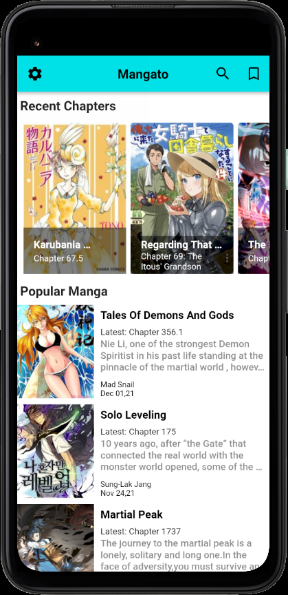](assets/screenshots/screenshot1.png)
[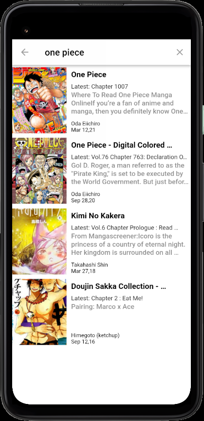](assets/screenshots/screenshot2.png)
[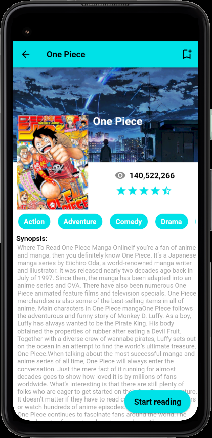](assets/screenshots/screenshot3.png)
[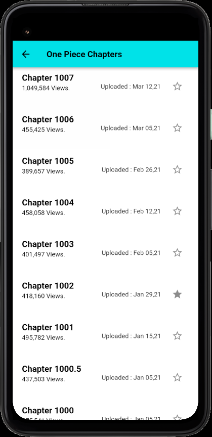](assets/screenshots/screenshot4.png)
[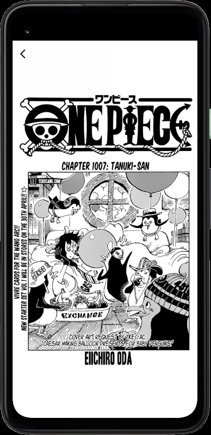](assets/screenshots/screenshot5.png)
[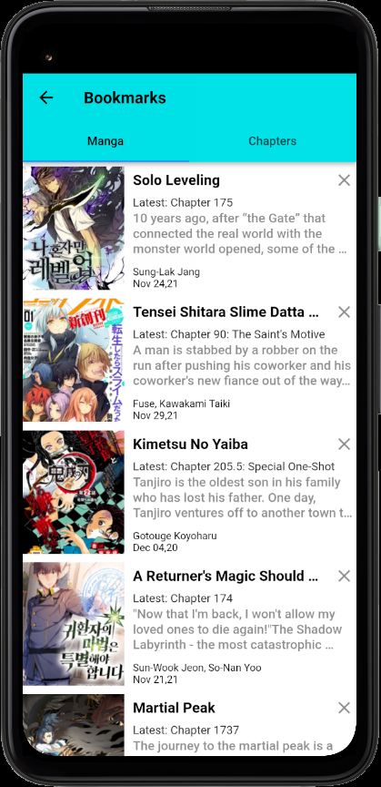](assets/screenshots/screenshot6.png)
[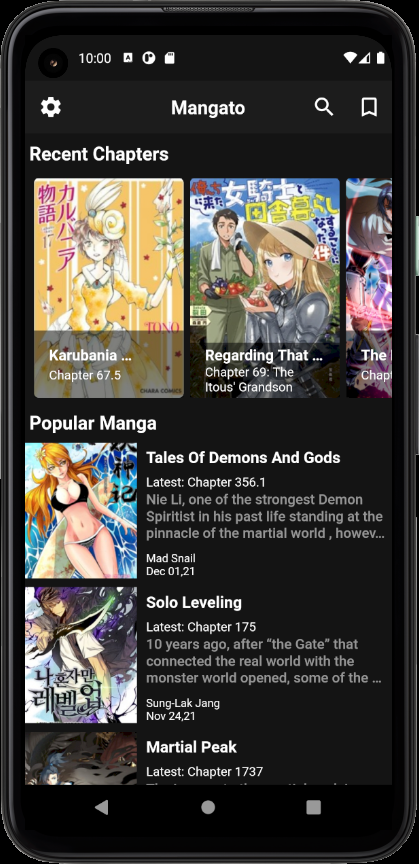](assets/screenshots/screenshot1.1.png)
[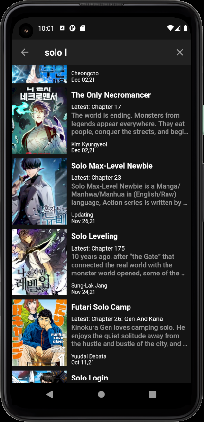](assets/screenshots/screenshot2.1.png)
[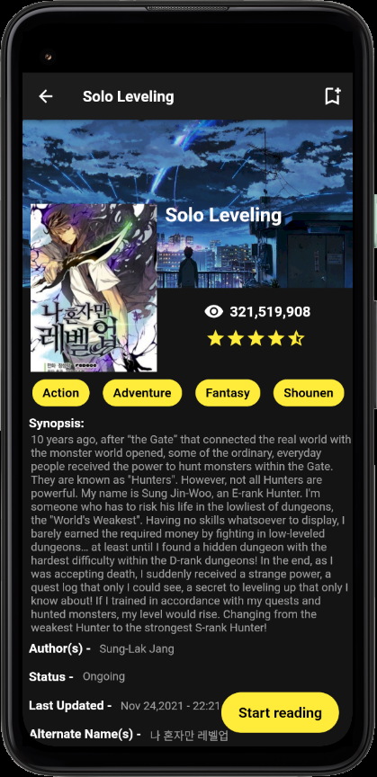](assets/screenshots/screenshot3.1.png)
[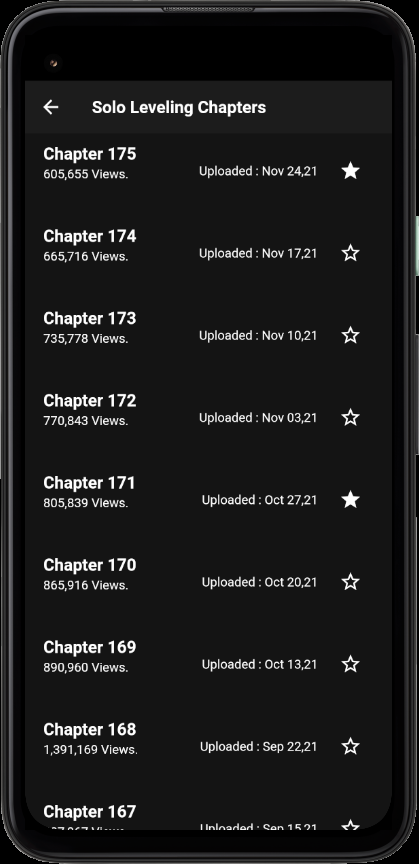](assets/screenshots/screenshot4.1.png)
[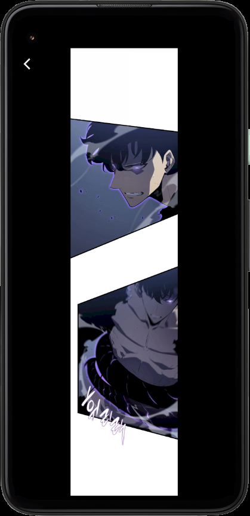](assets/screenshots/screenshot5.1.png)
[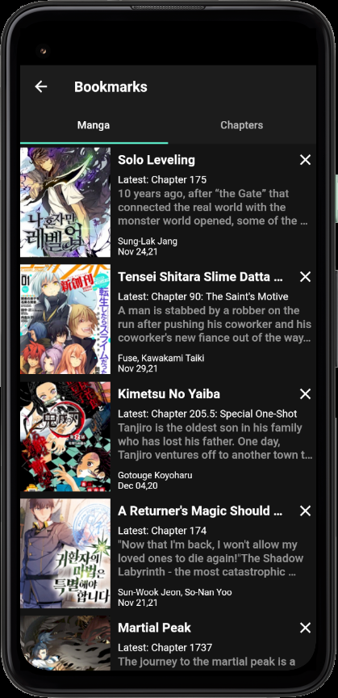](assets/screenshots/screenshot6.1.png)

## Description

Mangato parses website data and filters the necessary information, Therefore it removes advertisements for a better user experience. You do not need to create an account to use the app.

## API Reference
[API Repo](https://github.com/riimuru/Mangato-api) This api is being used in this project.

## Features

- Search Manga
- Recent Manga Chapters
- Popular Manga
- Add To Bookmarks
- Dark Mode Support

## Coming Features

- Ability to zoom in when reading manga.
- Online syncing of reading progress.
- Ability to download chapters.
- ...and many more.

## Technologies used

- [Flutter](https://docs.flutter.dev/)
- [Dart](https://dart.dev/)
- [flutter_swiper](https://pub.dev/packages/flutter_swiper)
- [sqflite](https://pub.dev/packages/sqflite)
- [provider](https://pub.dev/packages/provider)
- [shared_preferences](https://pub.dev/packages/shared_preferences)
- [flutter_native_splash](https://pub.dev/packages/flutter_native_splash)

## Contribution

Your suggestions, translations, design modifications, code cleaning, or major code changes, as well as any other help, are always welcome. The greater the contribution, the better.

[Pull requests](https://github.com/riimuru/Mangato/pulls) will be reviewed
